# Mizan Architecture

Mizan is a local-first visual configuration architect for HAProxy and Nginx. It is built as a Go single-binary application with an embedded React/Vite WebUI. The current implementation is a working foundation: projects can be created or imported, persisted as JSON, edited as IR, visualized as topology, generated into HAProxy/Nginx config, validated, snapshotted, tagged, diffed, reverted, audited, associated with deployment targets or clusters, and previewed as a dry-run deployment plan.

## Current Project Status

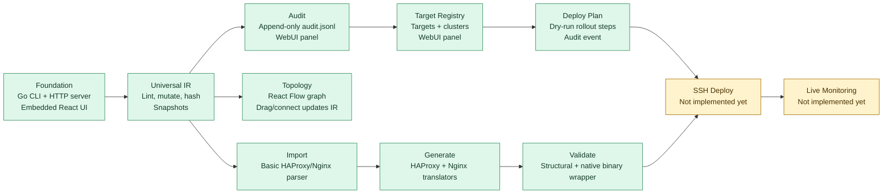

## High-Level Shape

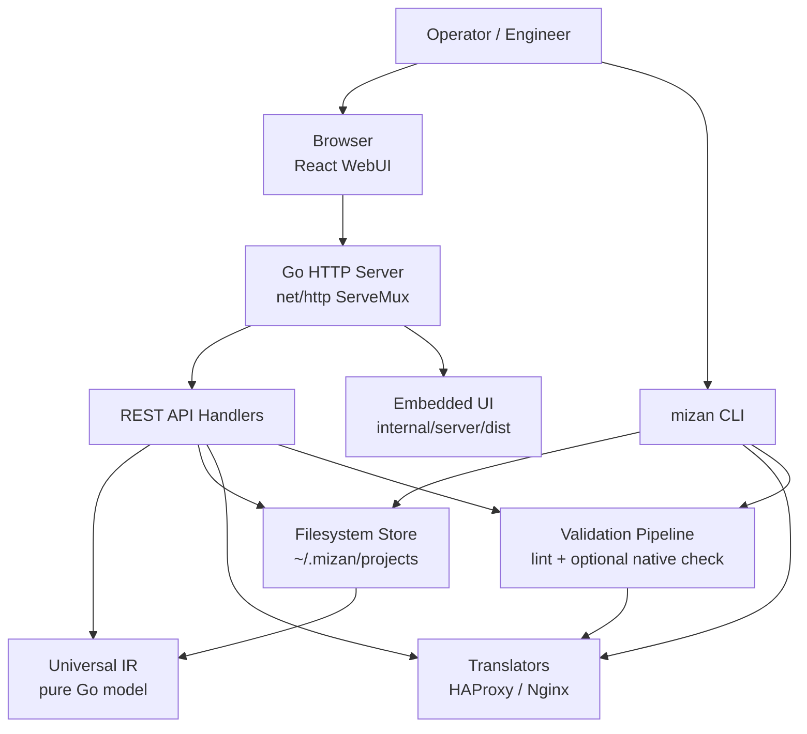

Mizan intentionally avoids a database and a backend web framework. The backend uses Go standard library primitives where practical, with the filesystem as the durable source of truth.

## Repository Layout

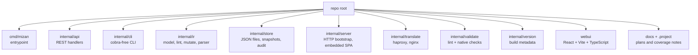

## Backend Dependency Direction

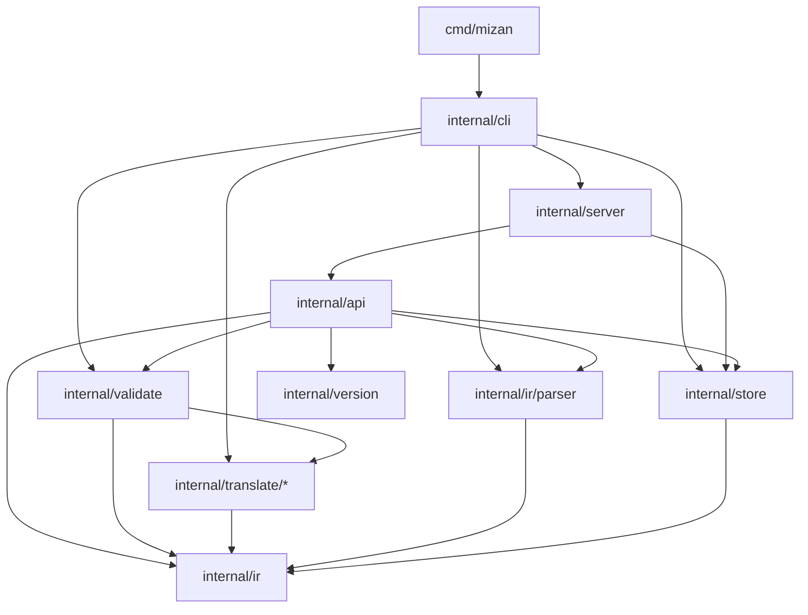

The IR package is the core domain layer. Translators, validation, storage, API, CLI, and WebUI all orbit around it.

## Universal IR

The IR is the canonical configuration model. The UI, topology, generators, validators, snapshots, and audit trail all refer to this model.

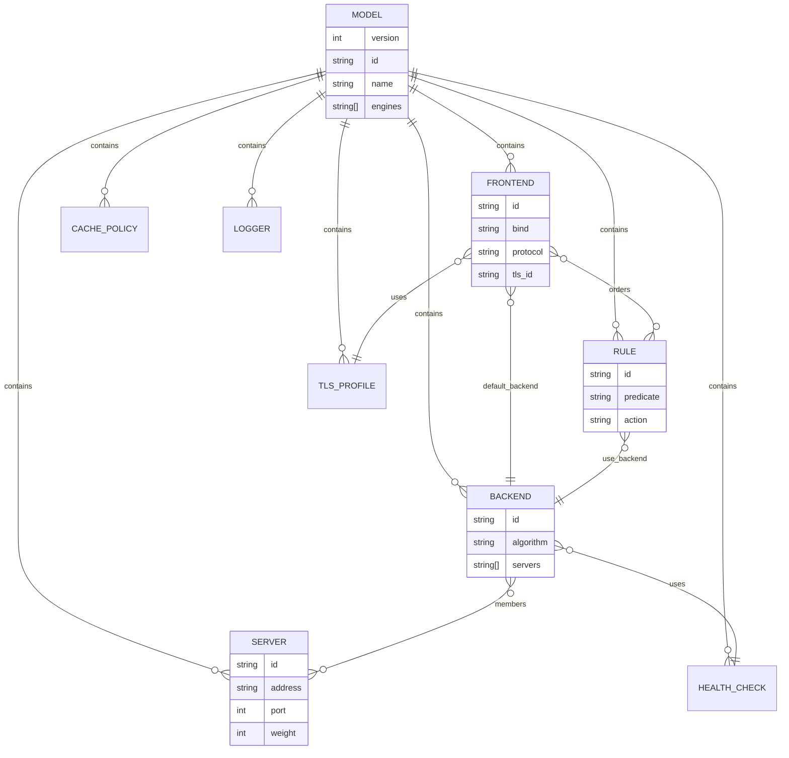

## Request Flow

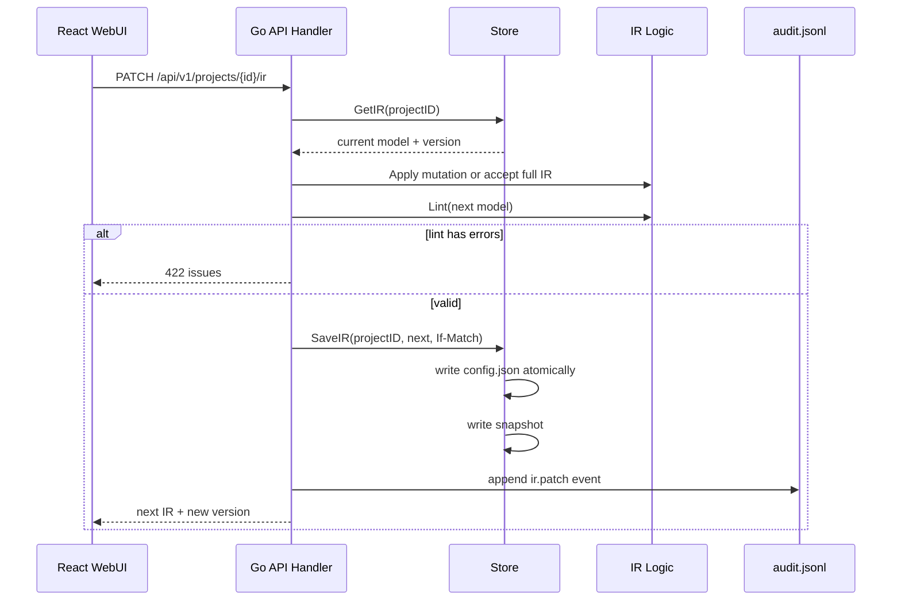

## Import Flow

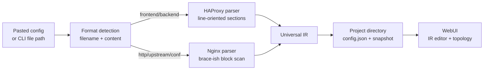

Current parser coverage is intentionally basic. It handles the core v0 subset: frontends/listeners, backends/upstreams, servers, TLS certificate paths, default backends, simple ACL/location routing, weights, and basic health checks.

## Generation and Validation

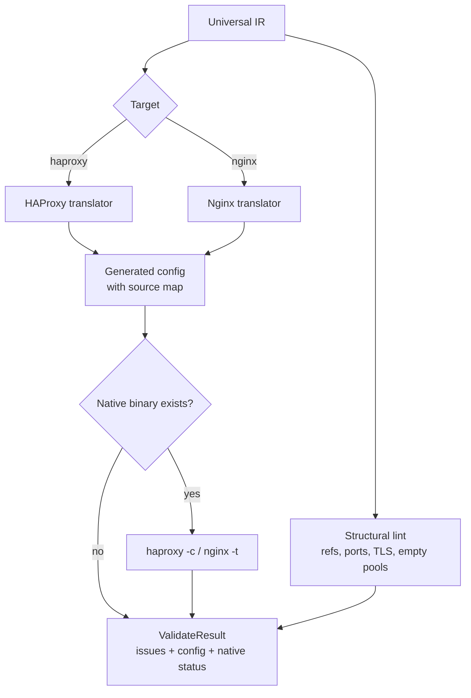

The current native validation wrapper is opportunistic: if `haproxy` or `nginx` is not on `PATH`, validation is marked as skipped rather than crashing the workflow.

## Deployment Dry Run

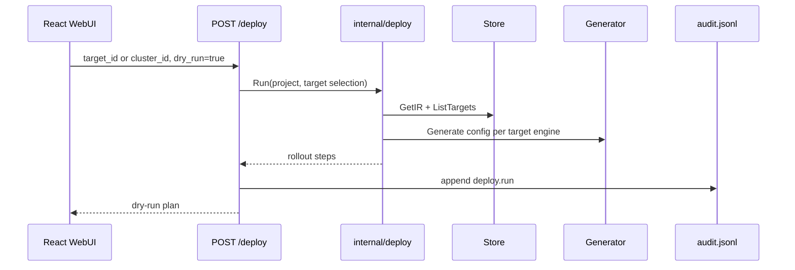

The deploy package now computes the concrete rollout steps for one target or a cluster: upload generated config, remote validate, install, reload, and optional post-reload probe. The WebUI currently invokes this as a dry run. The same backend path has command-runner and probe hooks for future real SSH execution.

The same flow is exposed from the CLI:

```sh
mizan deploy --project <id> --target-id <target-id>
mizan deploy --project <id> --cluster-id <cluster-id>
```

Targets and clusters can also be managed from the CLI:

```sh
mizan target add --project <id> --name edge-01 --host 10.0.0.10 --engine haproxy
mizan target list --project <id>
mizan cluster add --project <id> --name prod --target-ids <target-id>
mizan cluster list --project <id>
```

CLI deploy defaults to dry-run planning. Passing `--execute` switches to the real command runner.

## Topology Editing

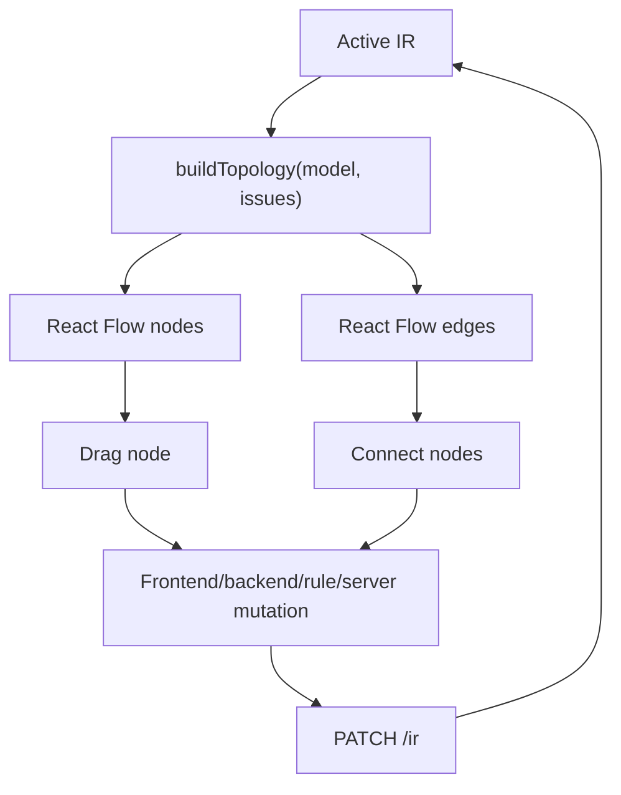

Supported topology mutations:

| Gesture | IR effect |
|---|---|
| Drag frontend/backend/rule | Persists `view.x` / `view.y` |
| Connect frontend to backend | Sets `frontend.default_backend` |
| Connect rule to backend | Sets `rule.action.backend_id` |
| Connect frontend to rule | Adds rule ID to frontend rule order |
| Connect backend to server | Adds server ID to backend members |

## Storage Layout

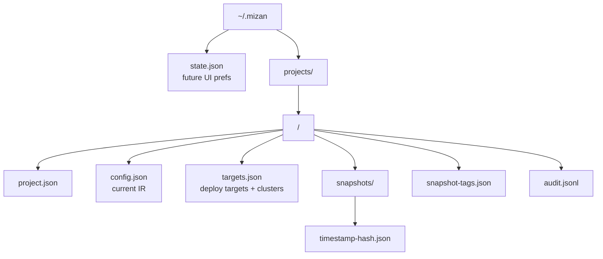

Writes use temp-file + fsync + rename for the core JSON files. Audit events are append-only JSON Lines.

## Snapshot and Audit Flow

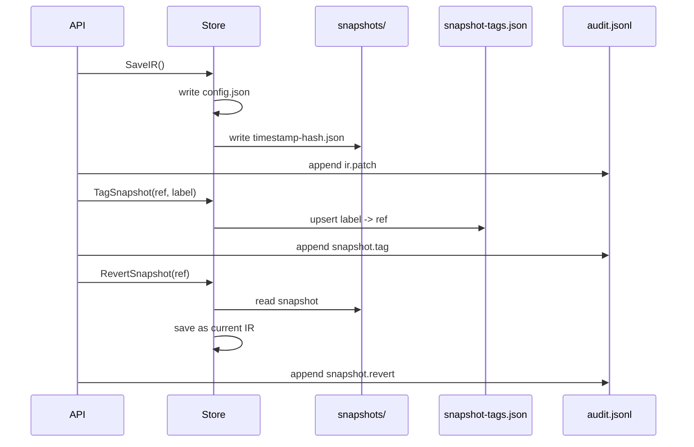

## WebUI State Model

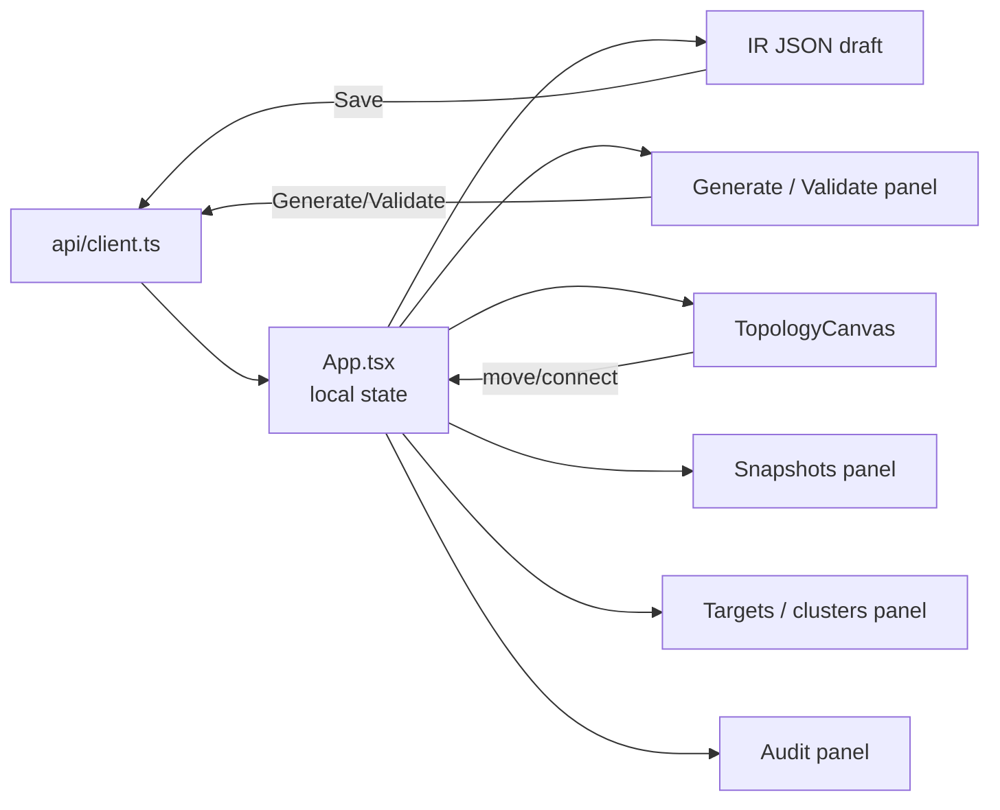

The frontend currently uses local React state and a small typed API client. A later phase can introduce TanStack Query/Zustand as originally planned, but the current app is intentionally simple and testable.

## Build and Runtime Packaging

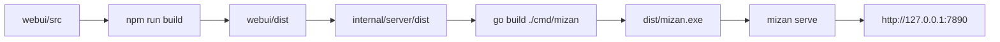

## Test and Coverage Status

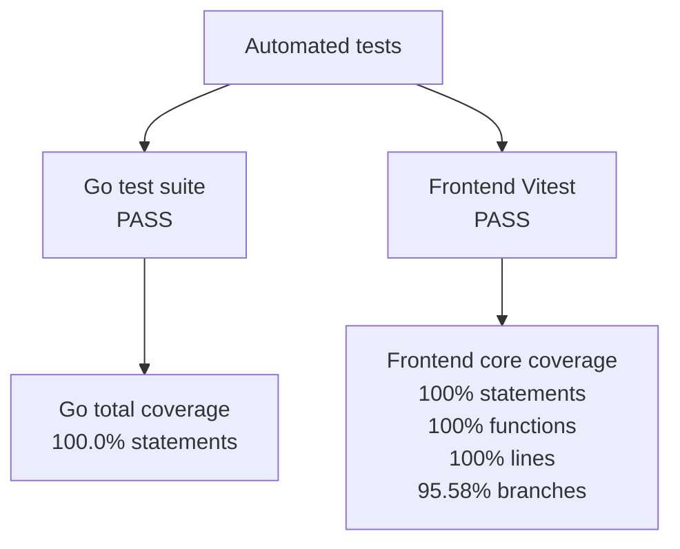

Current verified commands:

```sh
go test -coverprofile dist/coverage.out ./...
go tool cover -func dist/coverage.out
npm run lint
npm run test:coverage
npm run build
npm audit --omit=dev
```

Current coverage state:

| Area | Status |
|---|---:|
| Go test pass rate | 100% |
| Go total statement coverage | 100.0% |
| Frontend core statement coverage | 100% |
| Frontend core branch coverage | 95.58% |
| Frontend core function coverage | 100% |
| Frontend core line coverage | 100% |
| Production dependency audit | 0 vulnerabilities |

## Implemented Capabilities

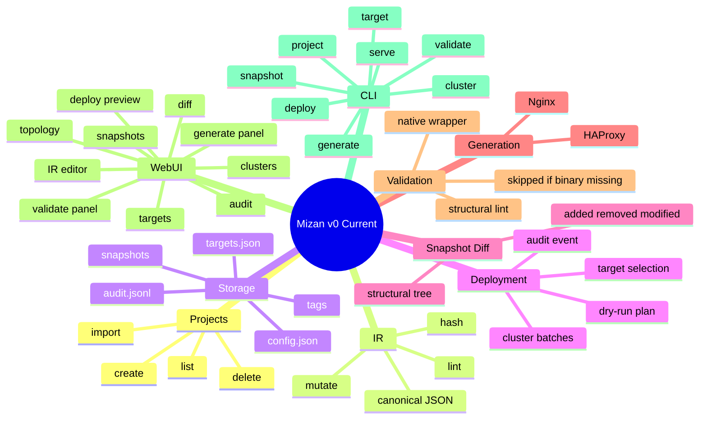

## Not Implemented Yet

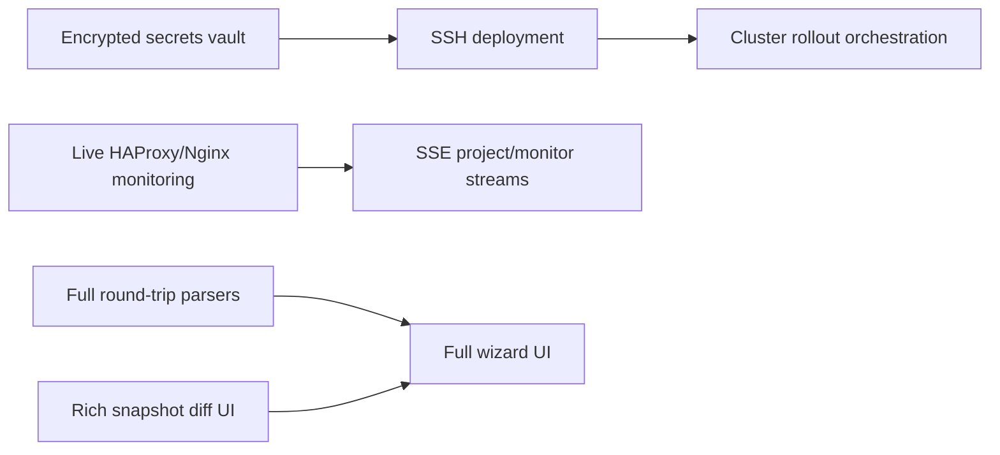

The codebase is now a working product foundation, not yet a full v1 implementation. Target and cluster persistence plus dry-run deployment planning exist, but real SSH execution, credential handling, and staged rollout safety gates are still future work. The next largest architectural slices are deployment execution, monitoring, full parser round-trip, richer wizard editing, and deeper diff UI.

## Design Principles

- **Local-first**: user data lives under `~/.mizan`.
- **Single binary**: Go backend embeds the built React UI.
- **IR-centered**: all editing, topology, validation, generation, snapshots, and audit are derived from the same model.
- **No database**: project state is JSON, easy to inspect and Git-version.
- **Pure translators**: target configs are deterministic outputs of the IR.
- **Append-only audit**: project history is observable and never rewritten.
- **Progressive hardening**: backend statement coverage is currently 100%, while frontend core library coverage is gated at 100% statements, functions, and lines.
