# Mizan Architecture

Mizan is a local-first visual configuration architect for HAProxy and Nginx. It is built as a Go single-binary application with an embedded React/Vite WebUI. The current implementation is a working foundation: projects can be created or imported, persisted as JSON, edited as IR, visualized as topology, generated into HAProxy/Nginx config, validated, snapshotted, tagged, diffed, reverted, audited, associated with deployment targets or clusters, and previewed as a dry-run deployment plan.

## Current Project Status

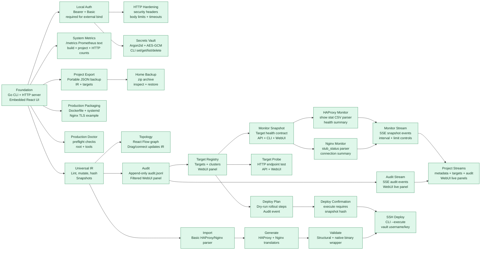
```mermaid
flowchart LR
  Foundation["Foundation\nGo CLI + HTTP server\nEmbedded React UI"]:::done
  Auth["Local Auth\nBearer + Basic\nrequired for external bind"]:::done
  Hardening["HTTP Hardening\nsecurity headers\nbody limits + timeouts"]:::done
  Secrets["Secrets Vault\nArgon2id + AES-GCM\nCLI set/get/list/delete"]:::done
  Metrics["System Metrics\n/metrics Prometheus text\nbuild + project + HTTP counts"]:::done
  ProjectExport["Project Export\nPortable JSON backup\nIR + targets"]:::done
  Backup["Home Backup\nzip archive\ninspect + restore"]:::done
  Packaging["Production Packaging\nDockerfile + systemd\nNginx TLS example"]:::done
  Doctor["Production Doctor\npreflight checks\nroot + tools"]:::done
  IR["Universal IR\nLint, mutate, hash\nSnapshots"]:::done
  Import["Import\nBasic HAProxy/Nginx parser"]:::done
  Generate["Generate\nHAProxy + Nginx translators"]:::done
  Validate["Validate\nStructural + native binary wrapper"]:::done
  Topology["Topology\nReact Flow graph\nDrag/connect updates IR"]:::done
  Audit["Audit\nAppend-only audit.jsonl\nFiltered WebUI panel"]:::done
  AuditStream["Audit Stream\nSSE audit events\nWebUI live panel"]:::done
  Targets["Target Registry\nTargets + clusters\nWebUI panel"]:::done
  TargetProbe["Target Probe\nHTTP endpoint test\nAPI + WebUI"]:::done
  DeployPlan["Deploy Plan\nDry-run rollout steps\nAudit event"]:::done
  MonitorBase["Monitor Snapshot\nTarget health contract\nAPI + CLI + WebUI"]:::done
  HAProxyMonitor["HAProxy Monitor\nshow stat CSV parser\nhealth summary"]:::done
  NginxMonitor["Nginx Monitor\nstub_status parser\nconnection summary"]:::done
  MonitorStream["Monitor Stream\nSSE snapshot events\ninterval + limit controls"]:::done
  Deploy["SSH Deploy\nCLI --execute\nvault username/key"]:::done
  DeployConfirm["Deploy Confirmation\nexecute requires\nsnapshot hash"]:::done
  ProjectStream["Project Streams\nmetadata + targets + audit\nWebUI live panels"]:::done

  Foundation --> Auth
  Auth --> Hardening
  Auth --> Secrets
  Foundation --> Metrics
  Foundation --> ProjectExport
  ProjectExport --> Backup
  Foundation --> Packaging
  Foundation --> Doctor
  Foundation --> IR --> Import --> Generate --> Validate
  IR --> Topology
  IR --> Audit
  Audit --> AuditStream
  Audit --> Targets
  Targets --> TargetProbe
  Targets --> DeployPlan
  DeployPlan --> DeployConfirm --> Deploy
  Validate --> Deploy
  Targets --> MonitorBase
  MonitorBase --> HAProxyMonitor
  MonitorBase --> NginxMonitor
  HAProxyMonitor --> MonitorStream
  NginxMonitor --> MonitorStream
  MonitorStream --> ProjectStream
  AuditStream --> ProjectStream

  classDef done fill:#dff7ea,stroke:#2b8a57,color:#153b27;
  classDef todo fill:#fff3cd,stroke:#a36b00,color:#4a3100;
```

## High-Level Shape

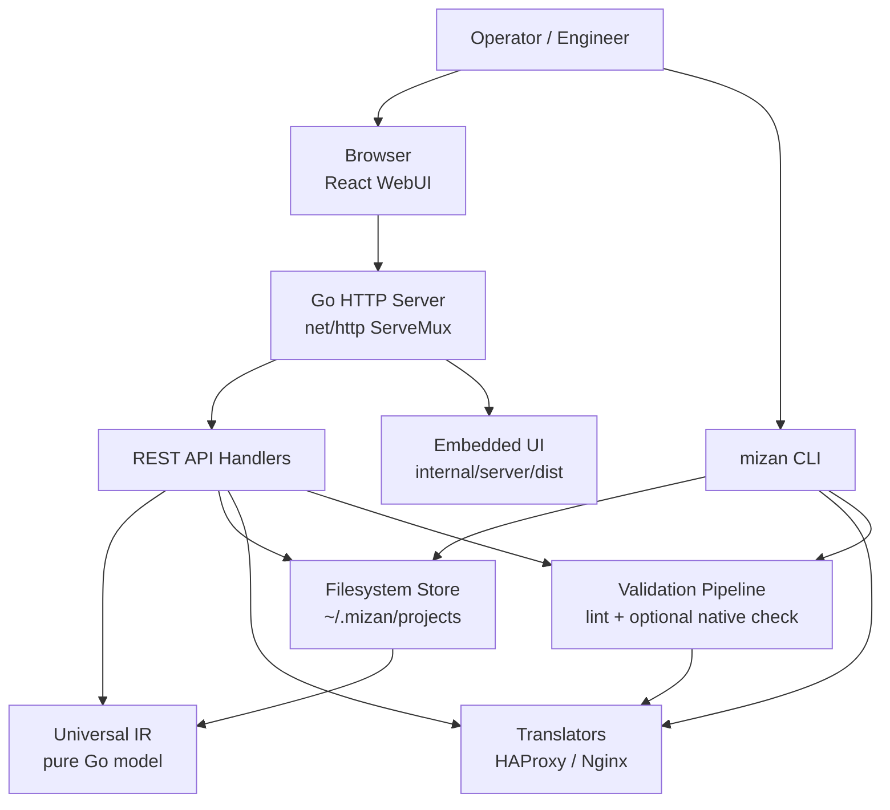
```mermaid
flowchart TB
  User["Operator / Engineer"]
  Browser["Browser\nReact WebUI"]
  CLI["mizan CLI"]
  Server["Go HTTP Server\nnet/http ServeMux"]
  API["REST API Handlers"]
  IR["Universal IR\npure Go model"]
  Store["Filesystem Store\n~/.mizan/projects"]
  Translators["Translators\nHAProxy / Nginx"]
  Validate["Validation Pipeline\nlint + optional native check"]
  Embedded["Embedded UI\ninternal/server/dist"]

  User --> Browser
  User --> CLI
  Browser --> Server
  CLI --> Store
  CLI --> Translators
  CLI --> Validate
  Server --> API
  Server --> Embedded
  API --> IR
  API --> Store
  API --> Translators
  API --> Validate
  Validate --> Translators
  Store --> IR
```

Mizan intentionally avoids a database and a backend web framework. The backend uses Go standard library primitives where practical, with the filesystem as the durable source of truth.

## Repository Layout

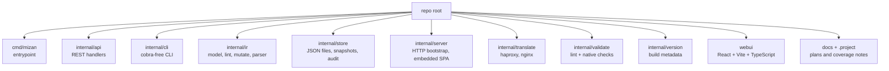
```mermaid
flowchart TB
  Root["repo root"]
  Cmd["cmd/mizan\nentrypoint"]
  API["internal/api\nREST handlers"]
  CLI["internal/cli\ncobra-free CLI"]
  IR["internal/ir\nmodel, lint, mutate, parser"]
  Store["internal/store\nJSON files, snapshots, audit"]
  Server["internal/server\nHTTP bootstrap, embedded SPA"]
  Translate["internal/translate\nhaproxy, nginx"]
  Validate["internal/validate\nlint + native checks"]
  Version["internal/version\nbuild metadata"]
  WebUI["webui\nReact + Vite + TypeScript"]
  Docs["docs + .project\nplans and coverage notes"]

  Root --> Cmd
  Root --> API
  Root --> CLI
  Root --> IR
  Root --> Store
  Root --> Server
  Root --> Translate
  Root --> Validate
  Root --> Version
  Root --> WebUI
  Root --> Docs
```

## Backend Dependency Direction

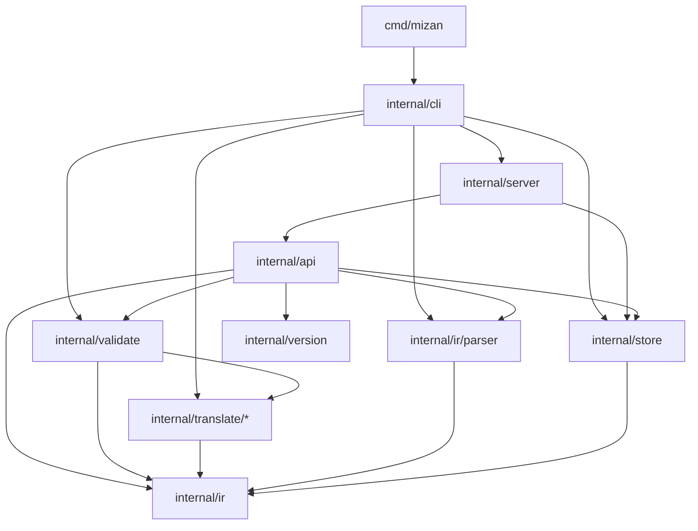
```mermaid
flowchart TD
  Main["cmd/mizan"]
  CLI["internal/cli"]
  Server["internal/server"]
  API["internal/api"]
  Store["internal/store"]
  Validate["internal/validate"]
  Translate["internal/translate/*"]
  IR["internal/ir"]
  Parser["internal/ir/parser"]
  Version["internal/version"]

  Main --> CLI
  CLI --> Server
  CLI --> Store
  CLI --> Validate
  CLI --> Translate
  CLI --> Parser
  Server --> API
  Server --> Store
  API --> Store
  API --> IR
  API --> Parser
  API --> Validate
  API --> Version
  Validate --> IR
  Validate --> Translate
  Translate --> IR
  Parser --> IR
  Store --> IR
```

The IR package is the core domain layer. Translators, validation, storage, API, CLI, and WebUI all orbit around it.

## Universal IR

The IR is the canonical configuration model. The UI, topology, generators, validators, snapshots, and audit trail all refer to this model.

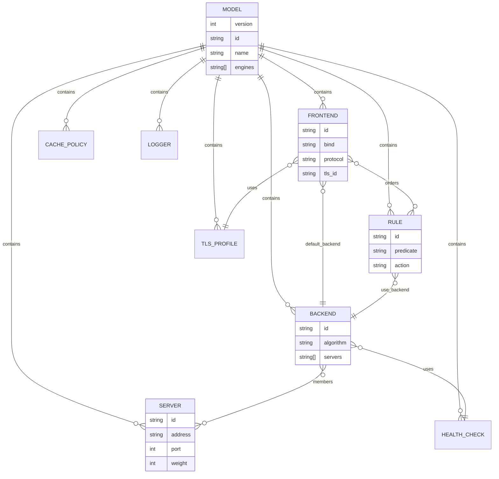
```mermaid
erDiagram
  MODEL ||--o{ FRONTEND : contains
  MODEL ||--o{ BACKEND : contains
  MODEL ||--o{ SERVER : contains
  MODEL ||--o{ RULE : contains
  MODEL ||--o{ TLS_PROFILE : contains
  MODEL ||--o{ HEALTH_CHECK : contains
  MODEL ||--o{ CACHE_POLICY : contains
  MODEL ||--o{ LOGGER : contains
  FRONTEND }o--|| TLS_PROFILE : uses
  FRONTEND }o--o{ RULE : orders
  FRONTEND }o--|| BACKEND : default_backend
  RULE }o--|| BACKEND : use_backend
  BACKEND }o--o{ SERVER : members
  BACKEND }o--|| HEALTH_CHECK : uses

  MODEL {
    int version
    string id
    string name
    string[] engines
  }
  FRONTEND {
    string id
    string bind
    string protocol
    string tls_id
  }
  BACKEND {
    string id
    string algorithm
    string[] servers
  }
  SERVER {
    string id
    string address
    int port
    int weight
  }
  RULE {
    string id
    string predicate
    string action
  }
```

## Request Flow

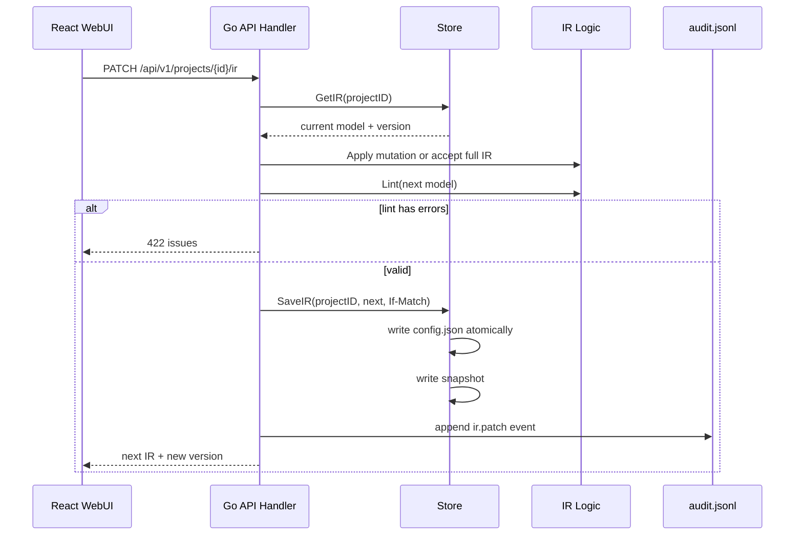
```mermaid
sequenceDiagram
  participant Browser as React WebUI
  participant API as Go API Handler
  participant Store as Store
  participant IR as IR Logic
  participant Audit as audit.jsonl

  Browser->>API: PATCH /api/v1/projects/{id}/ir
  API->>Store: GetIR(projectID)
  Store-->>API: current model + version
  API->>IR: Apply mutation or accept full IR
  API->>IR: Lint(next model)
  alt lint has errors
    API-->>Browser: 422 issues
  else valid
    API->>Store: SaveIR(projectID, next, If-Match)
    Store->>Store: write config.json atomically
    Store->>Store: write snapshot
    API->>Audit: append ir.patch event
    API-->>Browser: next IR + new version
  end
```

## Import Flow

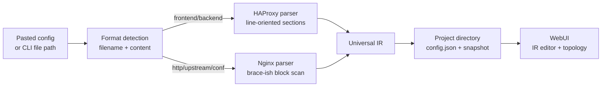
```mermaid
flowchart LR
  Paste["Pasted config\nor CLI file path"]
  Detect["Format detection\nfilename + content"]
  HAProxyParser["HAProxy parser\nline-oriented sections"]
  NginxParser["Nginx parser\nbrace-ish block scan"]
  IR["Universal IR"]
  Store["Project directory\nconfig.json + snapshot"]
  UI["WebUI\nIR editor + topology"]

  Paste --> Detect
  Detect -->|frontend/backend| HAProxyParser
  Detect -->|http/upstream/conf| NginxParser
  HAProxyParser --> IR
  NginxParser --> IR
  IR --> Store
  Store --> UI
```

Current parser coverage is intentionally basic. It handles the core v0 subset: frontends/listeners, backends/upstreams, servers, TLS certificate paths, default backends, simple ACL/location routing, weights, and basic health checks.

## Export Flow

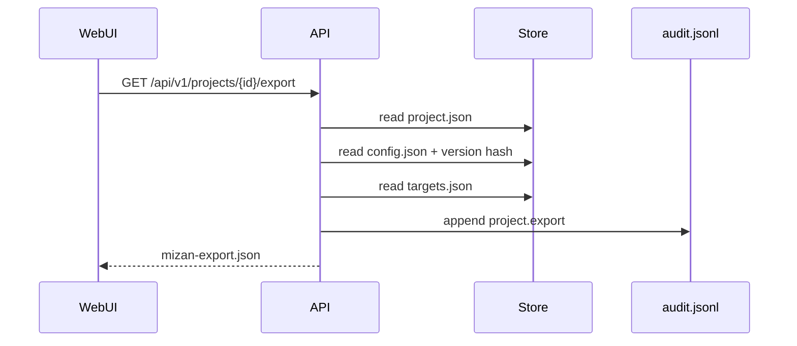
```mermaid
sequenceDiagram
  participant WebUI
  participant API
  participant Store
  participant Audit as audit.jsonl

  WebUI->>API: GET /api/v1/projects/{id}/export
  API->>Store: read project.json
  API->>Store: read config.json + version hash
  API->>Store: read targets.json
  API->>Audit: append project.export
  API-->>WebUI: mizan-export.json
```

## Generation and Validation

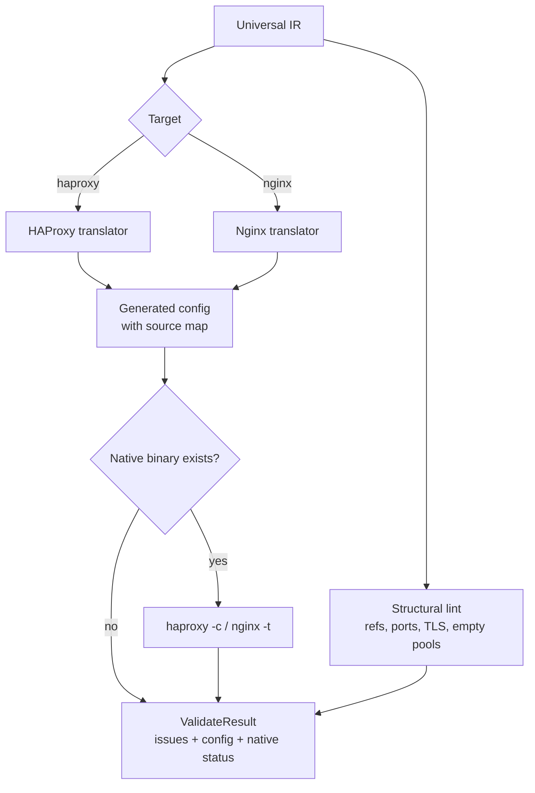
```mermaid
flowchart TD
  IR["Universal IR"]
  Lint["Structural lint\nrefs, ports, TLS, empty pools"]
  Target{"Target"}
  HGen["HAProxy translator"]
  NGen["Nginx translator"]
  Config["Generated config\nwith source map"]
  Native{"Native binary exists?"}
  NativeCheck["haproxy -c / nginx -t"]
  Result["ValidateResult\nissues + config + native status"]

  IR --> Lint
  IR --> Target
  Target -->|haproxy| HGen
  Target -->|nginx| NGen
  HGen --> Config
  NGen --> Config
  Config --> Native
  Native -->|yes| NativeCheck
  Native -->|no| Result
  NativeCheck --> Result
  Lint --> Result
```

The current native validation wrapper is opportunistic: if `haproxy` or `nginx` is not on `PATH`, validation is marked as skipped rather than crashing the workflow.

## Deployment Dry Run

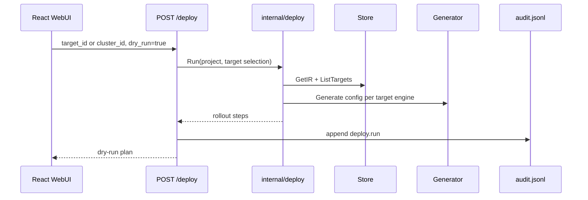
```mermaid
sequenceDiagram
  participant Browser as React WebUI
  participant API as POST /deploy
  participant Deploy as internal/deploy
  participant Store as Store
  participant Translate as Generator
  participant Audit as audit.jsonl

  Browser->>API: target_id or cluster_id, dry_run=true
  API->>Deploy: Run(project, target selection)
  Deploy->>Store: GetIR + ListTargets
  Deploy->>Translate: Generate config per target engine
  Deploy-->>API: rollout steps
  API->>Audit: append deploy.run
  API-->>Browser: dry-run plan
```

The deploy package computes the rollout steps for one target or a cluster: upload generated config, remote validate, install, reload, optional post-reload probe, and remote temp-file cleanup. The WebUI currently invokes this as a dry run. The CLI defaults to dry-run planning and can run the same path with `--execute`, using the local `ssh` command to execute each remote step.

Approval requests are persisted per project in `approvals.json`. `POST /api/v1/projects/{id}/approvals` and `mizan approval request` capture the current IR snapshot hash for a target or cluster rollout, store the required approval count from the selected cluster, and emit `approval.request` audit events. `POST /api/v1/projects/{id}/approvals/{approvalID}/approve` and `mizan approval approve` record distinct approvers case-insensitively and mark the request approved once the threshold is met. Deploy execution can reference `approval_request_id` or `--approval-request-id`; Mizan then verifies the target or cluster, batch, and snapshot hash before passing the approved actors into the deploy gate. The WebUI can create approval requests from target or cluster cards, collect named approvals, preview the approved request, and execute it after an explicit browser confirmation.

Target probe checks reuse the same HTTP probe helper without running SSH or deployment steps. `POST /api/v1/projects/{id}/targets/{targetID}/probe` tests a target's `post_reload_probe` URL, falling back to `monitor_endpoint`, and records a `target.probe` audit event.

The same flow is exposed from the CLI:

```sh
mizan deploy --project <id> --target-id <target-id>
mizan deploy --project <id> --cluster-id <cluster-id>
mizan approval request --project <id> --cluster-id <cluster-id> --batch 1
mizan approval approve --project <id> --actor alice <approval-request-id>
mizan deploy --project <id> --approval-request-id <approval-request-id> --execute
mizan monitor snapshot --project <id>
mizan monitor stream --project <id> --limit 10 --interval 5s
```

Targets and clusters can also be managed from the CLI:

```sh
mizan target add --project <id> --name edge-01 --host 10.0.0.10 --engine haproxy --monitor-endpoint 'http://10.0.0.10:8404/;csv'
mizan target list --project <id>
mizan cluster add --project <id> --name prod --target-ids <target-id>
mizan cluster list --project <id>
```

CLI deploy defaults to dry-run planning. Passing `--execute` switches to the real command runner. If `--vault-passphrase` or `MIZAN_VAULT_PASSPHRASE` is available, deploy looks up a secret with the target id and applies its username and private key to the local `ssh` invocation. Deployment steps and audit metadata report only credential source names (`vault` or `local_ssh`), never secret values. Password and passphrase automation still depends on the local SSH environment, such as an agent or existing SSH config. The default container `runtime` target intentionally omits `openssh-client`; use the `runtime-ssh` Docker target when the container must execute remote deployments itself.

## Monitor Snapshot

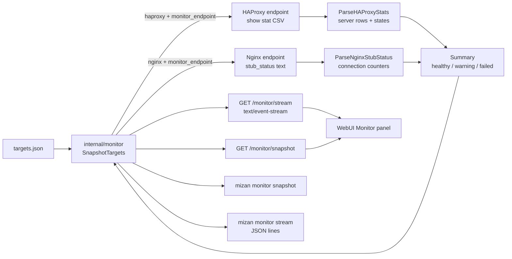
```mermaid
flowchart LR
  Store["targets.json"]
  Monitor["internal/monitor\nSnapshotTargets"]
  HAProxy["HAProxy endpoint\nshow stat CSV"]
  Nginx["Nginx endpoint\nstub_status text"]
  Parser["ParseHAProxyStats\nserver rows + states"]
  NginxParser["ParseNginxStubStatus\nconnection counters"]
  Summary["Summary\nhealthy / warning / failed"]
  API["GET /monitor/snapshot"]
  Stream["GET /monitor/stream\ntext/event-stream"]
  CLI["mizan monitor snapshot"]
  CLIStream["mizan monitor stream\nJSON lines"]
  UI["WebUI Monitor panel"]

  Store --> Monitor
  Monitor -->|haproxy + monitor_endpoint| HAProxy
  Monitor -->|nginx + monitor_endpoint| Nginx
  HAProxy --> Parser
  Nginx --> NginxParser
  Parser --> Summary
  NginxParser --> Summary
  Summary --> Monitor
  Monitor --> API
  Monitor --> Stream
  Monitor --> CLI
  Monitor --> CLIStream
  Stream --> UI
  API --> UI
```

The monitoring layer exposes a stable snapshot contract for registered targets. HAProxy targets can now provide a `monitor_endpoint` that returns HAProxy `show stat` CSV, commonly exposed by HAProxy stats HTTP endpoints. Mizan parses backend server rows, ignores aggregate `FRONTEND` and `BACKEND` rows, and summarizes the target as `healthy`, `warning`, or `failed`.

Nginx targets can provide a `monitor_endpoint` that returns OSS `stub_status` text. Mizan parses active connections, accepted/handled/request counters, and reading/writing/waiting gauges. Parsed Nginx snapshots are `healthy` unless accepted connections exceed handled connections, which is surfaced as `warning`.

Targets without a monitor endpoint return `unknown`, which keeps the API, CLI, and WebUI behavior predictable. The same snapshot contract is also exposed as an SSE stream at `/api/v1/projects/{id}/monitor/stream`; it emits `snapshot` events immediately and then on an interval, with test-friendly `limit` and `interval` query controls. The WebUI consumes this stream through `EventSource` while a project is open, and the CLI mirrors it with `mizan monitor stream`, emitting one JSON snapshot per line for terminal or script consumers.

## Topology Editing

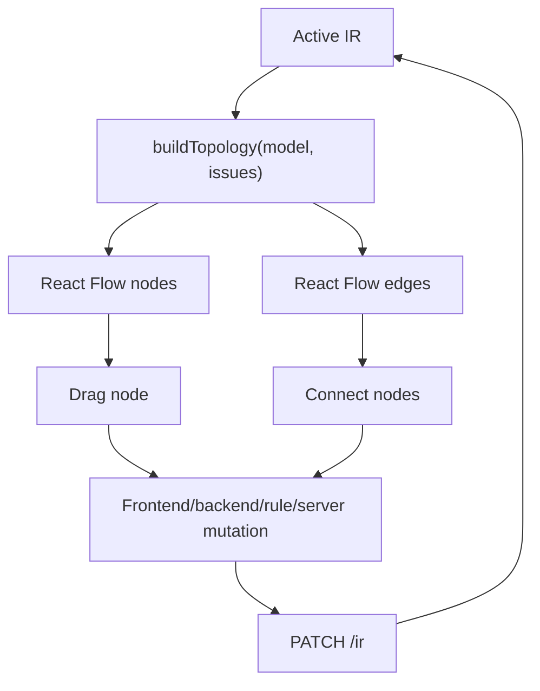
```mermaid
flowchart TB
  IR["Active IR"]
  Build["buildTopology(model, issues)"]
  Nodes["React Flow nodes"]
  Edges["React Flow edges"]
  Drag["Drag node"]
  Connect["Connect nodes"]
  Mutate["Frontend/backend/rule/server mutation"]
  Save["PATCH /ir"]

  IR --> Build
  Build --> Nodes
  Build --> Edges
  Nodes --> Drag
  Edges --> Connect
  Drag --> Mutate
  Connect --> Mutate
  Mutate --> Save
  Save --> IR
```

Supported topology mutations:

| Gesture | IR effect |
|---|---|
| Drag frontend/backend/rule | Persists `view.x` / `view.y` |
| Connect frontend to backend | Sets `frontend.default_backend` |
| Connect rule to backend | Sets `rule.action.backend_id` |
| Connect frontend to rule | Adds rule ID to frontend rule order |
| Connect backend to server | Adds server ID to backend members |

## Storage Layout

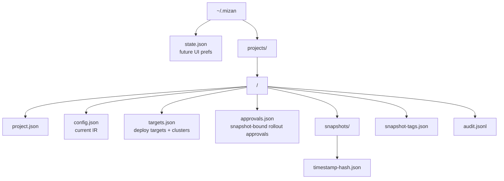
```mermaid
flowchart TB
  Home["~/.mizan"]
  State["state.json\nfuture UI prefs"]
  Projects["projects/"]
  Project["<project-id>/"]
  Meta["project.json"]
  Config["config.json\ncurrent IR"]
  Targets["targets.json\ndeploy targets + clusters"]
  Approvals["approvals.json\nsnapshot-bound rollout approvals"]
  Snapshots["snapshots/"]
  Snapshot["timestamp-hash.json"]
  Tags["snapshot-tags.json"]
  Audit["audit.jsonl"]

  Home --> State
  Home --> Projects
  Projects --> Project
  Project --> Meta
  Project --> Config
  Project --> Targets
  Project --> Approvals
  Project --> Snapshots
  Snapshots --> Snapshot
  Project --> Tags
  Project --> Audit
```

Writes use temp-file + fsync + rename for the core JSON files. Audit events are append-only JSON Lines.

## Snapshot and Audit Flow

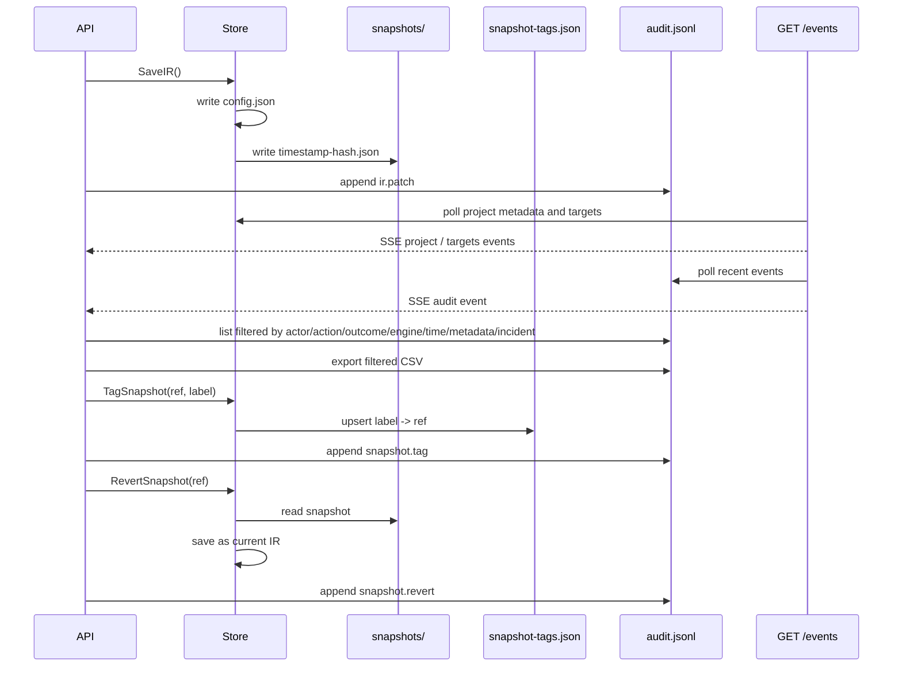
```mermaid
sequenceDiagram
  participant API
  participant Store
  participant Snapshot as snapshots/
  participant Tags as snapshot-tags.json
  participant Audit as audit.jsonl
  participant EventStream as GET /events

  API->>Store: SaveIR()
  Store->>Store: write config.json
  Store->>Snapshot: write timestamp-hash.json
  API->>Audit: append ir.patch
  EventStream->>Store: poll project metadata and targets
  EventStream-->>API: SSE project / targets events
  EventStream->>Audit: poll recent events
  EventStream-->>API: SSE audit event
  API->>Audit: list filtered by actor/action/outcome/engine/time/metadata/incident
  API->>Audit: export filtered CSV

  API->>Store: TagSnapshot(ref, label)
  Store->>Tags: upsert label -> ref
  API->>Audit: append snapshot.tag

  API->>Store: RevertSnapshot(ref)
  Store->>Snapshot: read snapshot
  Store->>Store: save as current IR
  API->>Audit: append snapshot.revert
```

## WebUI State Model

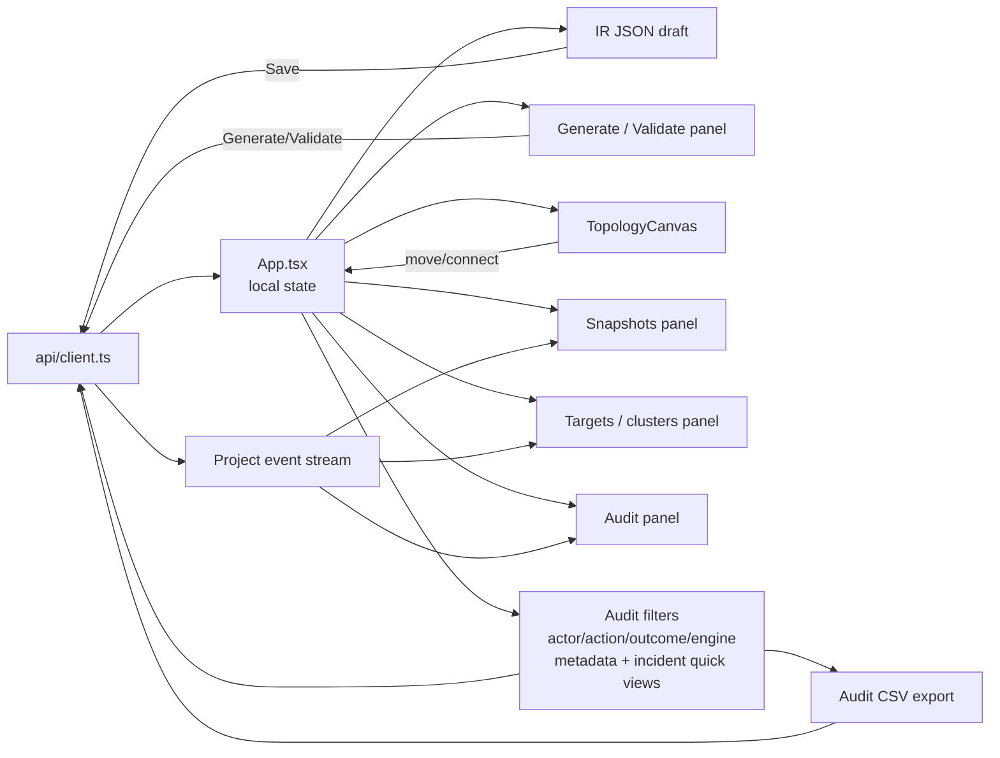
```mermaid
flowchart LR
  APIClient["api/client.ts"]
  App["App.tsx\nlocal state"]
  IRDraft["IR JSON draft"]
  GeneratePanel["Generate / Validate panel"]
  Topology["TopologyCanvas"]
  Snapshots["Snapshots panel"]
  Targets["Targets / clusters panel"]
  Audit["Audit panel"]
  AuditFilters["Audit filters\nactor/action/outcome/engine\nmetadata + incident quick views"]
  AuditCSV["Audit CSV export"]
  EventStream["Project event stream"]

  APIClient --> App
  App --> IRDraft
  App --> GeneratePanel
  App --> Topology
  App --> Snapshots
  App --> Targets
  App --> Audit
  App --> AuditFilters
  AuditFilters --> APIClient
  AuditFilters --> AuditCSV
  AuditCSV --> APIClient
  APIClient --> EventStream
  EventStream --> Audit
  EventStream --> Targets
  EventStream --> Snapshots
  Topology -->|move/connect| App
  IRDraft -->|Save| APIClient
  GeneratePanel -->|Generate/Validate| APIClient
```

The frontend intentionally uses local React state and a small typed API client. This keeps the v0.1 operator surface simple, fast to reason about, and easy to cover with browser E2E tests.

## Build and Runtime Packaging

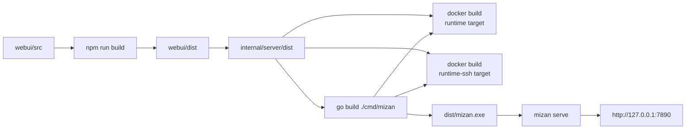
```mermaid
flowchart LR
  WebSrc["webui/src"]
  Vite["npm run build"]
  WebDist["webui/dist"]
  EmbedDist["internal/server/dist"]
  GoBuild["go build ./cmd/mizan"]
  DockerBuild["docker build\nruntime target"]
  DockerSSH["docker build\nruntime-ssh target"]
  Binary["dist/mizan.exe"]
  Serve["mizan serve"]
  Browser["http://127.0.0.1:7890"]

  WebSrc --> Vite --> WebDist
  WebDist --> EmbedDist
  EmbedDist --> GoBuild
  EmbedDist --> DockerBuild
  EmbedDist --> DockerSSH
  GoBuild --> DockerBuild
  GoBuild --> DockerSSH
  GoBuild --> Binary
  Binary --> Serve --> Browser
```

## Test and Coverage Status

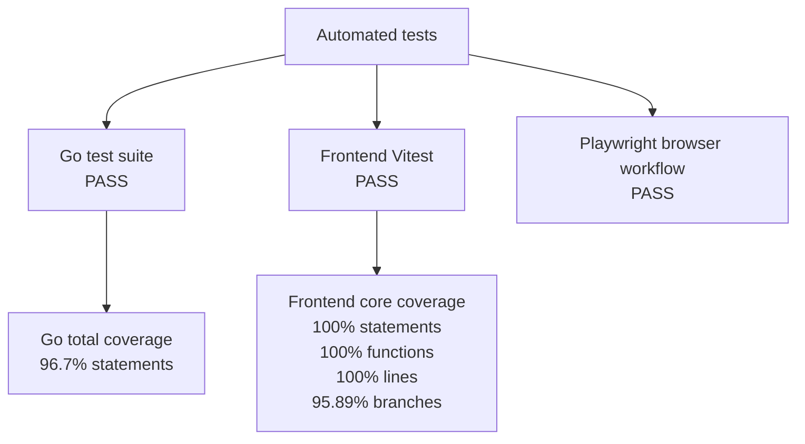
```mermaid
flowchart TB
  Tests["Automated tests"]
  Go["Go test suite\nPASS"]
  FE["Frontend Vitest\nPASS"]
  E2E["Playwright browser workflow\nPASS"]
  FECoverage["Frontend core coverage\n100% statements\n100% functions\n100% lines\n95.89% branches"]
  GoCoverage["Go total coverage\n96.7% statements"]

  Tests --> Go
  Tests --> FE
  Tests --> E2E
  FE --> FECoverage
  Go --> GoCoverage
```

Current verified commands:

```sh
go test -coverprofile dist/coverage.out ./...
go tool cover -func dist/coverage.out
go run golang.org/x/vuln/cmd/govulncheck@latest ./...
npm run lint
npm run test:coverage
npm run test:e2e
npm run build
npm audit --audit-level=low
make container-scan
```

Current coverage state:

| Area | Status |
|---|---:|
| Go test pass rate | 100% |
| Go total statement coverage | 96.7% |
| Frontend core statement coverage | 100% |
| Frontend core branch coverage | 95.89% |
| Frontend core function coverage | 100% |
| Frontend core line coverage | 100% |
| Browser E2E workflow | Playwright Chromium pass |
| Full npm audit | 0 vulnerabilities |
| Go vulnerability scan | govulncheck pass: 0 vulnerabilities |
| Container high/critical scan | Anchore/Grype CI gate pass; Docker Scout local gate pass |

## Implemented Capabilities

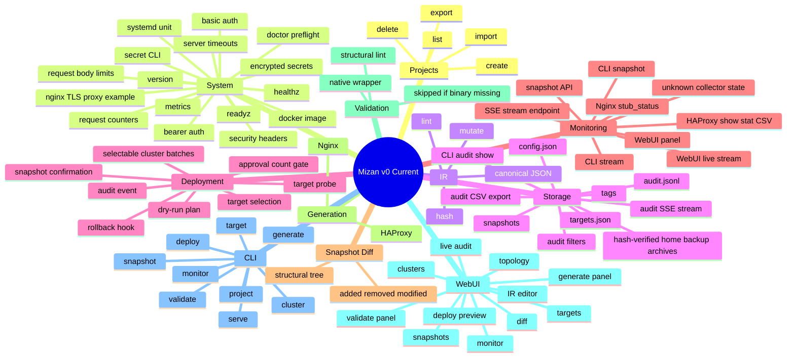
```mermaid
mindmap
  root((Mizan v0 Current))
    Projects
      create
      list
      delete
      import
      export
    System
      healthz
      readyz
      version
      metrics
      request counters
      bearer auth
      basic auth
      security headers
      request body limits
      server timeouts
      docker image
      systemd unit
      nginx TLS proxy example
      doctor preflight
      encrypted secrets
      secret CLI
    IR
      lint
      mutate
      hash
      canonical JSON
    Storage
      config.json
      snapshots
      tags
      audit.jsonl
      audit SSE stream
      audit filters
      audit CSV export
      CLI audit show
      targets.json
      hash-verified home backup archives
    Deployment
      dry-run plan
      snapshot confirmation
      approval count gate
      rollback hook
      target probe
      target selection
      selectable cluster batches
      audit event
    Monitoring
      snapshot API
      CLI snapshot
      CLI stream
      WebUI panel
      WebUI live stream
      SSE stream endpoint
      HAProxy show stat CSV
      Nginx stub_status
      unknown collector state
    Snapshot Diff
      structural tree
      added removed modified
    Generation
      HAProxy
      Nginx
    Validation
      structural lint
      native wrapper
      skipped if binary missing
    WebUI
      IR editor
      generate panel
      validate panel
      topology
      snapshots
      diff
      targets
      clusters
      deploy preview
      monitor
      live audit
    CLI
      serve
      project
      snapshot
      target
      cluster
      generate
      validate
      deploy
      monitor
```

## Release Scope Boundaries

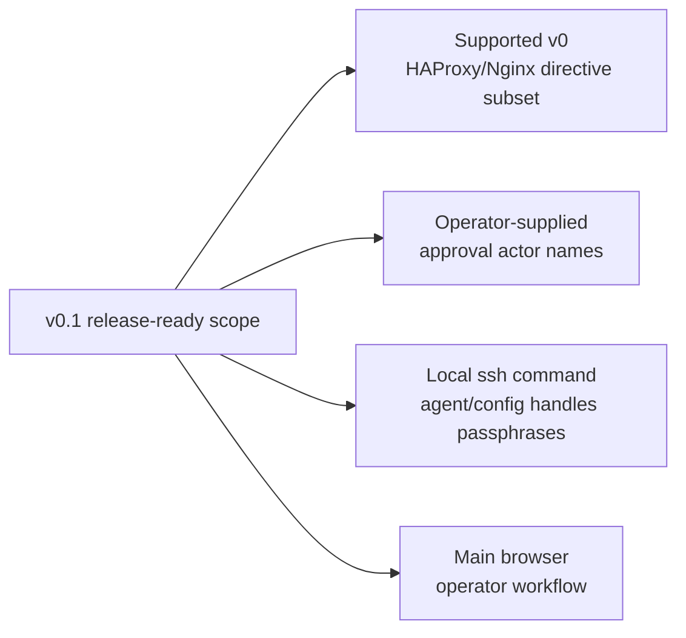
```mermaid
flowchart LR
  V01["v0.1 release-ready scope"]
  Parser["Supported v0\nHAProxy/Nginx directive subset"]
  Identity["Operator-supplied\napproval actor names"]
  SSH["Local ssh command\nagent/config handles passphrases"]
  E2E["Main browser\noperator workflow"]

  V01 --> Parser
  V01 --> Identity
  V01 --> SSH
  V01 --> E2E
```

The codebase is release-ready for the documented v0.1 scope. Target and cluster persistence, dry-run deployment planning, persisted approval requests, snapshot-bound execute confirmation, CLI SSH execution with vault-backed username/private-key credentials, selectable cluster batches, approval gates, rollback hooks, rollback summary audit metadata, HAProxy/Nginx monitor collectors, monitor streams, project state streams, filtered audit, CSV export, backups, and production packaging are implemented.

The remaining boundaries are explicit product limits rather than release blockers: import covers the supported v0 directive subset rather than every possible HAProxy/Nginx directive, approval identity is operator-supplied rather than backed by SSO/RBAC, SSH password/passphrase automation is delegated to the local SSH environment, and deep remote fault injection should be validated in an operator's staging environment before first production rollout.

## Design Principles

- **Local-first**: user data lives under `~/.mizan`.
- **Single binary**: Go backend embeds the built React UI.
- **IR-centered**: all editing, topology, validation, generation, snapshots, and audit are derived from the same model.
- **No database**: project state is JSON, easy to inspect and Git-version.
- **Pure translators**: target configs are deterministic outputs of the IR.
- **Append-only audit**: project history is observable and never rewritten.
- **Progressive hardening**: backend statement coverage is currently 96.7%, while frontend core library coverage is gated at 100% statements, functions, and lines.
